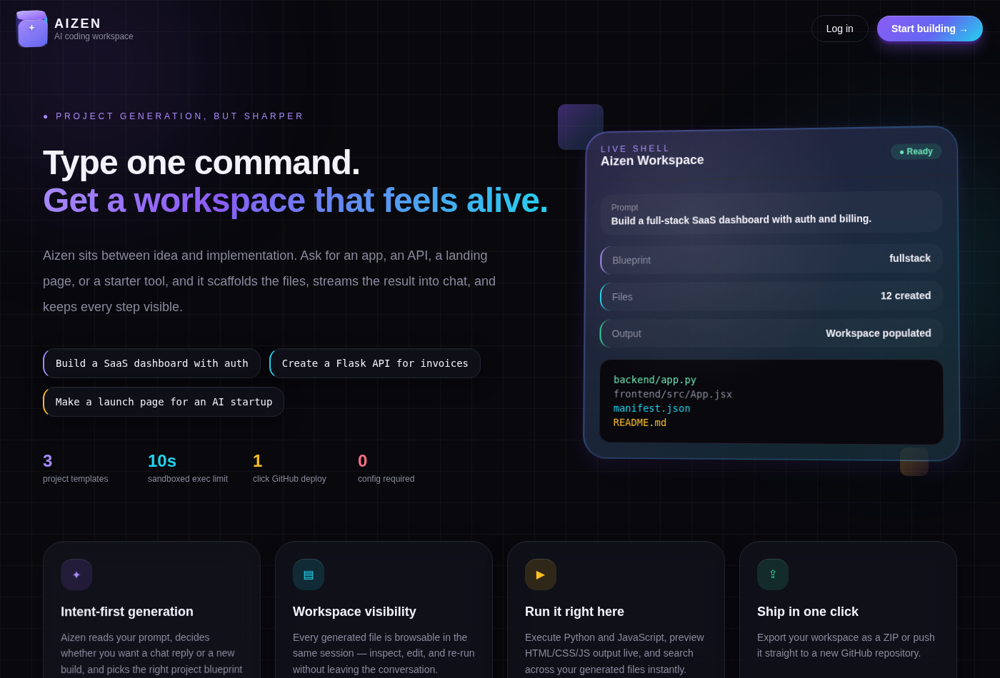
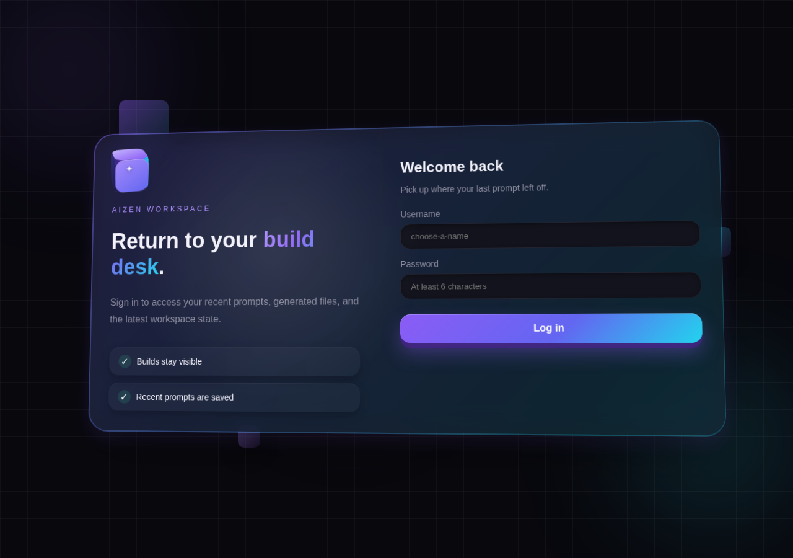
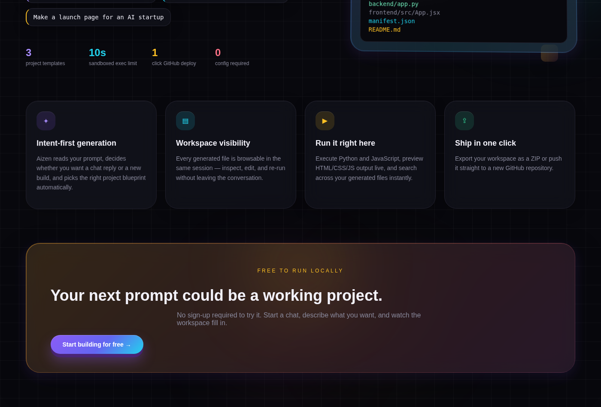

# Aizen

**Type a prompt. Get a working project.**

Aizen is a browser-based AI coding assistant. Describe what you want to build, and it classifies your intent, scaffolds a real project across ~10 tech stacks, and then keeps iterating on it — reading files, editing them, and validating the result — until it's actually done, not just generated once and abandoned.

<p align="center">
  
</p>


---

## What makes it different

Most "AI project generator" demos do one thing: call an LLM once, dump some files, done. Aizen is built around two ideas that go further:

- **Intent-first, not generation-first.** Every request first goes through an intent classifier that decides whether you're asking a question, asking to build something new, or asking to modify what's already in the workspace — so a follow-up like "add a dark mode toggle" edits your existing project instead of regenerating it from scratch.
- **An agent loop, not a single shot.** Build/modify requests hand off to an agent that lists files, reads one, edits one, runs a validation command, and repeats — for a bounded number of steps — until the result passes, rather than trusting the first draft.
- **It never returns nothing.** If the Groq call fails or times out, a deterministic local fallback still produces a working template, so a flaky API call never leaves you with an empty workspace.

## Features

| | |
|---|---|
| 🧠 **Intent classification** | Routes each prompt to chat, new-project, or modify-project handling automatically |
| 🏗️ **Multi-stack project generation** | Scaffolds full projects — plain HTML up to React + Flask — across ~10 supported stacks |
| 🔁 **Agentic build loop** | Iterative read → edit → validate cycle instead of one-shot generation |
| 💻 **Live editor & preview** | Monaco-powered in-browser editing with a live preview pane |
| ▶️ **Sandboxed code execution** | Run Python/JS snippets server-side with timeout protection |
| 🗄️ **SQL assistant** | Natural-language-to-SQL tool panel for querying data |
| 📊 **Analytics dashboard** | Recharts-based view of workspace stats — files, size, languages |
| 📦 **One-click export** | Download the generated workspace as a ZIP, or push straight to GitHub |
| 🔐 **Auth** | JWT-based signup/login with hashed credentials |

## Screenshots

<p align="center">
  
  
</p>

## Architecture

```
Browser (React + Vite)
   │  prompt
   ▼
Flask API  ──►  Intent Classifier
                     │
        ┌────────────┼─────────────┐
        ▼            ▼             ▼
    plain chat   new project   modify project
                     │             │
                     ▼             ▼
              Groq LLM (structured output)
                     │
             (on failure) ──► deterministic template fallback
                     │
                     ▼
              Agent loop: list → read → edit → validate  (bounded steps)
                     │
                     ▼
              workspace/  (files streamed back to the UI)
```

- **Backend** — Flask, SQLite, JWT auth, subprocess-sandboxed code execution, SSE streaming
- **Frontend** — React 19, Vite 8, Zustand, Tailwind CSS 4, Monaco Editor, Recharts

## Tech stack

**Backend:** Flask · Groq SDK · SQLite · PyJWT · python-dotenv
**Frontend:** React 19 · Vite 8 · Zustand · Tailwind CSS 4 · Monaco Editor · Recharts · React Router · react-markdown

## Getting started

### Prerequisites

- Python 3.10+
- Node.js + npm
- (Optional) A [Groq API key](https://console.groq.com) — without one, Aizen falls back to local template generation

### Backend

```bash
cd backend
python -m venv venv
venv\Scripts\python.exe -m pip install -r requirements.txt   # Windows
# source venv/bin/activate && pip install -r requirements.txt  # macOS/Linux
```

Create `backend/.env`:

```env
PORT=5000
JWT_SECRET=change-me-in-production-with-at-least-32-bytes
GROQ_API_KEY=your_key_here
```

```bash
python app.py
```

### Frontend

```bash
cd aizen/frontend
npm install
npm run dev -- --host 127.0.0.1
```

Open **http://127.0.0.1:5173** (backend health check: **http://127.0.0.1:5000/health**).

### Or use the one-shot scripts

```bash
start.bat     # Windows
sh start.sh   # macOS/Linux
```

## Try it

1. Open the app and confirm the backend status shows online
2. Prompt: `Build a full-stack SaaS dashboard with auth`
3. Watch the workspace populate — then try a follow-up like `add a settings page` and watch it modify the same project instead of starting over

## API reference

| Method | Endpoint | Purpose |
|---|---|---|
| `GET` | `/health` | Liveness check |
| `GET` | `/api/validate-key` | Validate configured Groq key |
| `POST` | `/api/signup` / `/api/login` | JWT auth |
| `GET` | `/api/me` | Current user |
| `GET` | `/api/history` | Prompt/build history |
| `POST` | `/api/smart-workflow` | Main entry point — intent classification → build/modify/chat |
| `GET` | `/api/files` | List workspace files |
| `GET`/`POST` | `/api/file_content` | Read / write a file |
| `POST` | `/api/execute` | Run Python/JS in a sandboxed subprocess |
| `POST` | `/api/nl2sql` | Natural language → SQL |
| `GET` | `/api/templates` / `POST /api/templates/<id>` | List and deploy starter templates |
| `GET` | `/api/export` | Download workspace as ZIP |
| `GET` | `/api/stats` / `/api/analytics` | Workspace metrics |
| `POST` | `/api/github-push` | Push the generated workspace to GitHub |

## Security notes

- Code execution runs in an isolated subprocess with a 10-second timeout
- File operations are constrained to the workspace directory (no path traversal)
- Passwords are hashed with Werkzeug; sessions use JWT
- Secrets live in `backend/.env`, which is git-ignored — never commit it

## Troubleshooting

<details>
<summary>Frontend says backend is offline</summary>

Confirm the backend is running on port `5000` and `http://127.0.0.1:5000/health` responds. Refresh the frontend once the backend is up.
</details>

<details>
<summary>Vite won't start in PowerShell</summary>

```bash
npm.cmd run dev -- --host 127.0.0.1
```
</details>

<details>
<summary>Backend import errors</summary>

Make sure you're running with the project virtual environment's interpreter, not a global Python install.
</details>

## License

MIT
